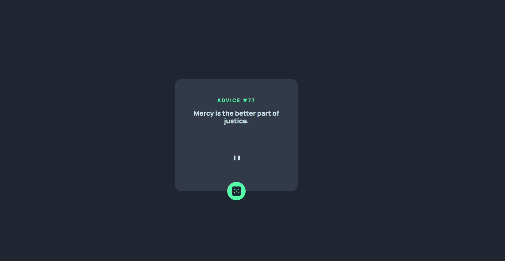

# Frontend Mentor - Solución de aplicación generadora de consejos

Esta es una solución al [Desafío de la aplicación de generador de consejos en Frontend Mentor](https://www.frontendmentor.io/challenges/advice-generator-app-QdUG-13db). Los desafíos de Frontend Mentor lo ayudan a mejorar sus habilidades de codificación mediante la creación de proyectos realistas.

## Tabla de contenidos

- [Resumen](#resumen)
  - [El reto](#el-reto)
  - [Captura de pantalla](#captura-de-pantalla)
  - [Enlaces](#enlaces)
- [Mi proceso](#mi-proceso)
  - [Construido con](#construido-con)
- [Autor](#autor)

## Visión general

### El reto

Los usuarios deben ser capaces de:

- Ver el diseño óptimo para la aplicación según el tamaño de pantalla de su dispositivo
- Ver estados de desplazamiento para todos los elementos interactivos en la página
- Genere un nuevo consejo haciendo clic en el icono de dado

### Captura de pantalla

### Enlaces

- URL de la solución: [Advice generator app](https://advice-generator-app-jjmm.netlify.app/)

## Mi proceso

### Construido con

- Marcado HTML5 semántico
- Propiedades personalizadas de CSS
- Flexbox
- Flujo de trabajo móvil primero
- [React](https://reactjs.org/) - Libreria de javascript
- [Sass](https://sass-lang.com/) - Para los estilos
- [Gulp](https://gulpjs.com/) - Para el compilado de Sass a css

## Author

- Frontend Mentor - [@jhonnymosquera](https://www.frontendmentor.io/profile/jhonnymosquera)
- Gmail - [jhonnymosquera.web@gmail.com](https://www.gmail.com)
